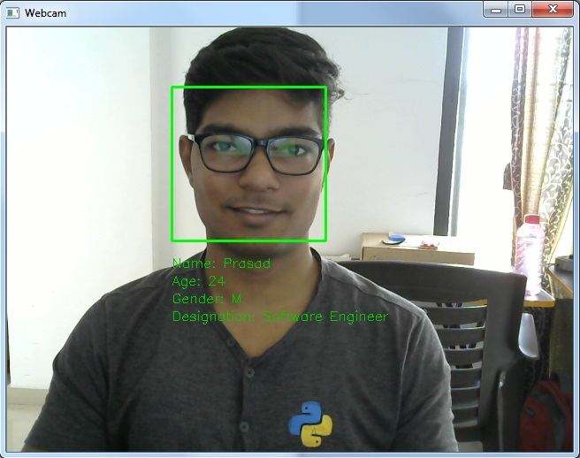

# Face Detection and Recognition
Detects and recognizes faces using python and opencv

<p align="center">
  
</p>
 

## Setup and Installation (Linux):

```bash
sudo pip install opencv-python   (Version: 3.3.1)
sudo pip install pillow
```

Download pre-trained classifier:
https://github.com/opencv/opencv/blob/master/data/haarcascades/haarcascade_frontalface_default.xml

Download sqlite-studio:
https://sqlitestudio.pl/index.rvt?act=download


